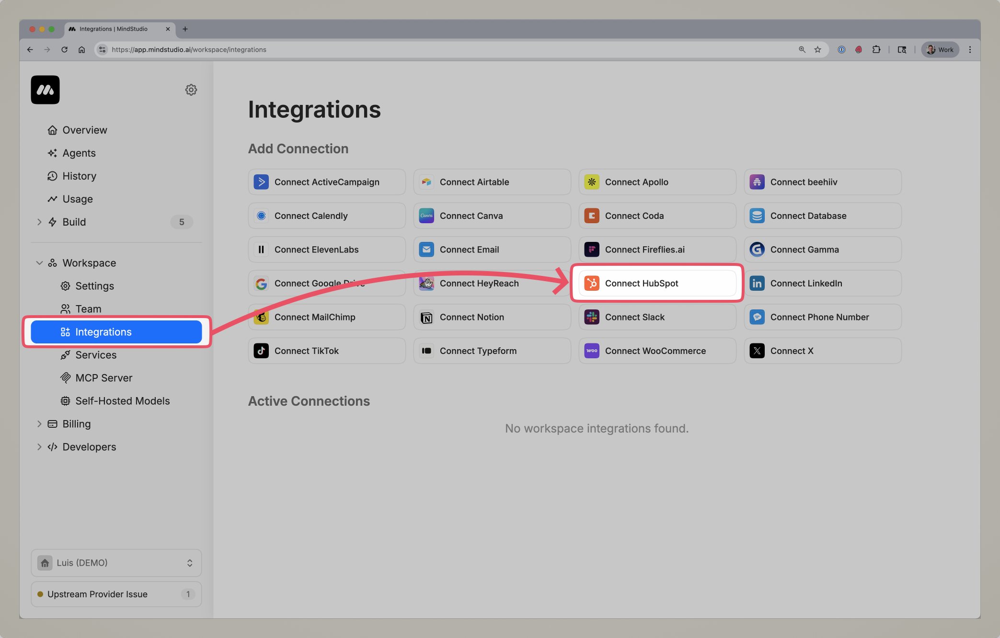
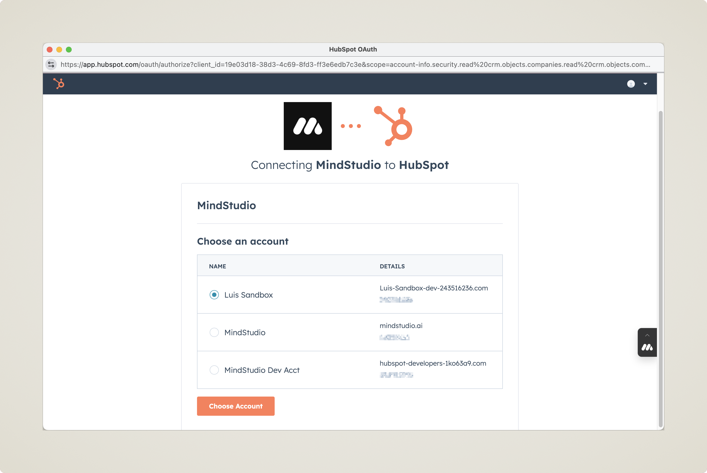
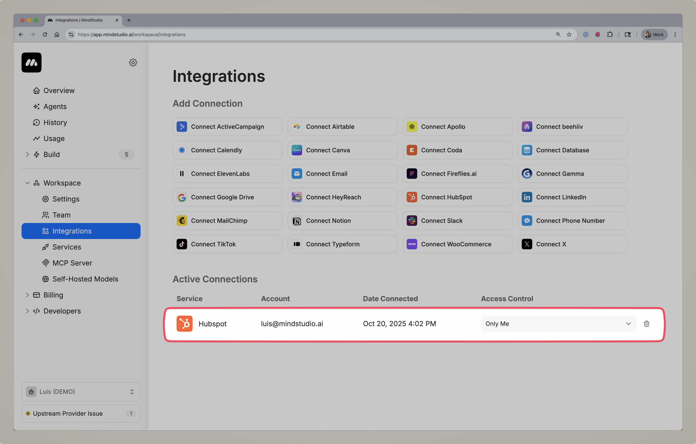
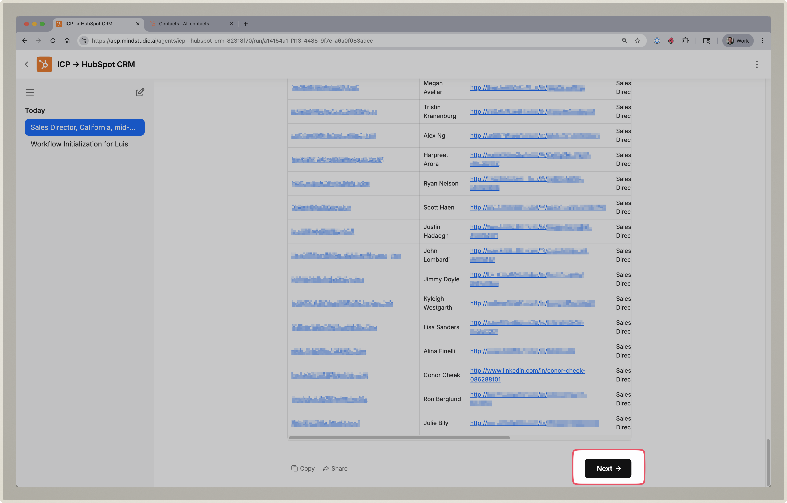
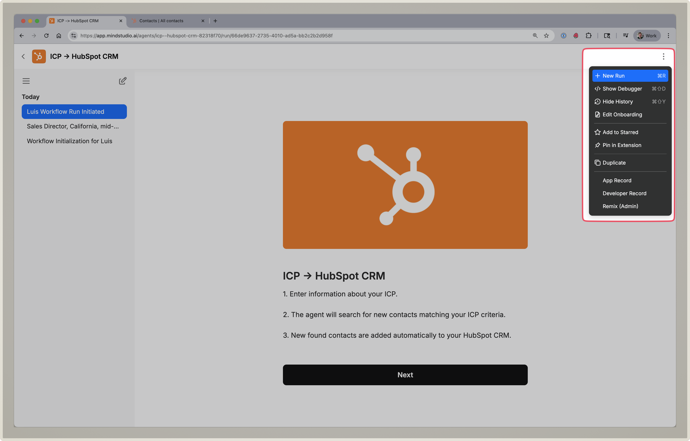
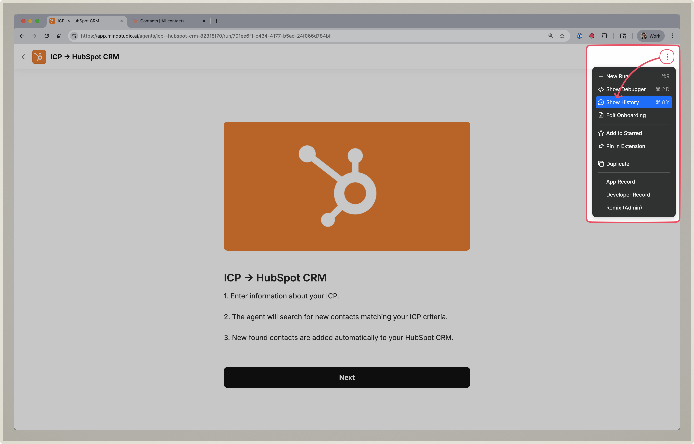
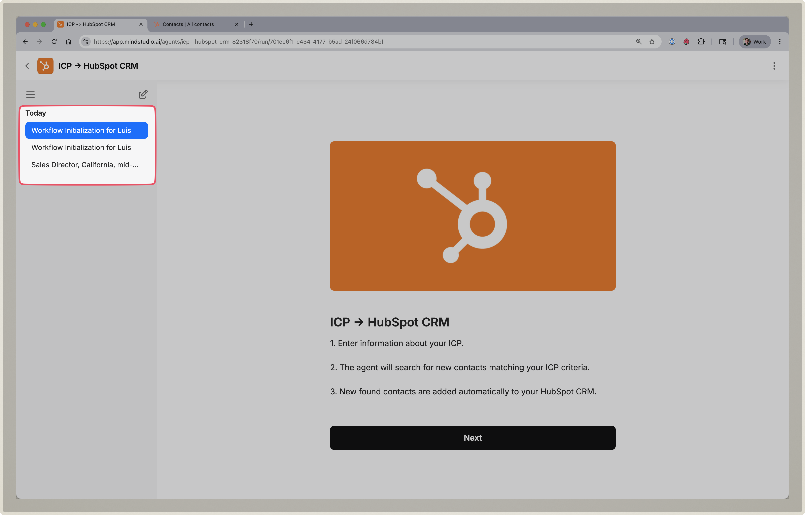

# How to Use the ICP → HubSpot Prospecting Agent

<figure><figcaption></figcaption></figure>

## Introduction

***

This guide is designed to help you put into action everything you learned during the workshop **From Empty to Engine: The New MindStudio Prospecting Agent**.

The AI Agent you’ll set up uses both **HubSpot** and **MindStudio**, working together to automate lead generation, qualification, and CRM enrichment based on your Ideal Customer Profile (ICP).

Below, you’ll find a step-by-step walkthrough for connecting both platforms, configuring your AI Agent, and turning your CRM from empty to engine — without manual prospecting.


**The setup process takes about 5 minutes. Once setup is complete, you’ll be able to access the AI Agent anytime you’d like to add new leads to your HubSpot CRM. 🙂**


🚀 Lets get started! Watch the video guide, or read the instructions below.

***

### Video Guide:



[https://youtu.be/sA\_NCKSr9iM](https://youtu.be/sA_NCKSr9iM)

***

### Step 1: Setup Your MindStudio & HubSpot Accounts

1. Sign up for MindStudio: [https://get.mindstudio.ai/h3x5vhgz6mng-q8zug6i](https://get.mindstudio.ai/h3x5vhgz6mng-q8zug6i)
2. Login to HubSpot: [https://app.hubspot.com/login](https://app.hubspot.com/login**)

***

### Step 2: Connect Your HubSpot CRM

1. After creating an account, navigate to the [**integrations page**](https://app.mindstudio.ai/workspace/integrations).
2.  Click on the **Connect HubSpot** button. This will open a pop-up window prompting you sign into HubSpot.

    <figure><figcaption></figcaption></figure>
3.  Once you’ve signed into HubSpot, select the CRM you’d like to connect to the Agent.\

    <figure><figcaption></figcaption></figure>
4.  After connecting MindStudio to HubSpot, You’ll see your connected account in the Actrive Accounts section.\

    <figure><figcaption></figcaption></figure>

### Step 3: Run the Agent

1. Enter information about your ICP.
2. The agent will search for new contacts matching your ICP criteria.
3. New found contacts are added automatically to your HubSpot CRM.
4. The agent will take about 5 minutes to run. When finished, it will display a table
5.  You can scroll down to the bottom of the table and click the next button to continue searching through the next page of leads.\

    <figure><figcaption></figcaption></figure>

***

### Starting A New Search

#### If you are not using the agent:

1. Click on the agent link: [\*\*](https://app.mindstudio.ai/agents/icp--hubspot-crm-82318f70/run/)[https://app.mindstudio.ai/agents/icp--hubspot-crm-82318f70/run/\*\*](https://app.mindstudio.ai/agents/icp--hubspot-crm-82318f70/run/**)
2. This will kickoff a new run for you to input new ICP Criteria

#### If you are currently using the agent:

1. Click on the 3 dots at the top-right corner
2.  Click on **New Run.**\

    <figure><figcaption></figcaption></figure>

***

### Viewing / Continuing a Previous Search

To access your previous searches you will need to **view the search history** of your agent:

1. Open the Agent.
2. Click on the 3 dots at the top right corner of the screen.
3.  Click on **Show Run History**.\

    <figure><figcaption></figcaption></figure>
4.  Select the search you’d like to continue running.\

    <figure><figcaption></figcaption></figure>
5.  Once you’ve selected a previous run, you can scroll down to the bottom of the table and click the next button to continue searching through the next page of leads.\

    <figure><figcaption></figcaption></figure>

***

### Tips for Getting Good Leads

***

Getting the most out of your Prospecting Agent starts with giving it the right level of focus. The AI uses your Ideal Customer Profile (ICP) to find and qualify leads — but it’s important to know that **this agent is not additive**.


**Adding more criteria doesn’t expand your search. It actually narrows it.** The more specific your criteria, the smaller your result set may be — and in some cases, **you may not find any leads at all** if your search is too restrictive.


#### **Adjust Scope Based on Your Goal**

If you want **more results**, keep your ICP broader (e.g., _B2B SaaS companies_).

If you want **fewer but highly targeted leads**, narrow your ICP (e.g., _B2B SaaS startups using HubSpot in North America_).

Experiment with both approaches to find the sweet spot for your pipeline goals.

#### **Start Simple, Then Refine**

Begin with only a few key ICP attributes such as **industry**, **region**, or **company size**. Once you see the first batch of results, refine your search with additional qualifiers to improve relevance.

#### **Use Clear and Common Role Titles**

When specifying target contacts, stick with standard job titles like _Head of Sales_, _Marketing Director_, or _Operations Manager_. Avoid unconventional or vague terms that the AI may not recognize consistently.

#### **Avoid Overloading the Keywords**

The agent works best with concise, structured input. Skip long sentences or multiple clauses — focus on short, descriptive phrases (e.g., Software\*, Saas, Retail, B2b\*).

#### **Iterate to Optimize**

Each run gives you a snapshot of what’s possible. Review your results and try again.

#### **Expect Variability**

Depending on your niche and specificity, some searches will return many results, while others might return few or none. This variability is normal — experiment with different input combinations to find what works best.


**Pro Tip:** If you discover a search that returns high or low quality results, take a note for future use. You can rerun it later to refresh your pipeline without starting from scratch.

