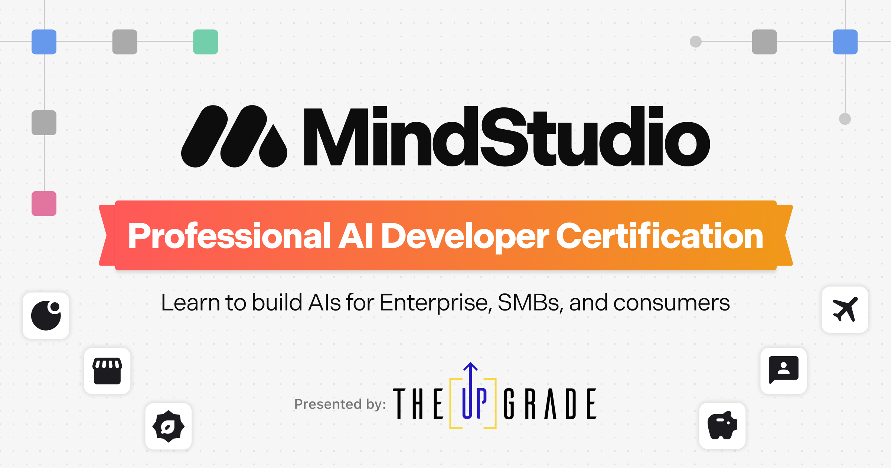

# MindStudio Certification

## Overview

This course offers an immersive experience in AI development, covering everything from the basics to advanced techniques. Perfect for both beginners and seasoned developers, this program will empower you with the skills to create sophisticated no-code AI applications.

<figure><figcaption></figcaption></figure>

## **Course Highlights**

* **Understanding AIs:** Start your journey with an engaging introduction to the world of AI. Learn about its core concepts and how MindStudio harnesses its power.
* **Hands-On AI Building:** Dive into practical sessions where you will plan, build, and refine AI projects. Experience the thrill of bringing your AI ideas to life.
* **Automations and Workflows:** Explore the intricacies of automations and workflows in AI development. Get hands-on with creating dynamic and interactive AI applications.
* **Prompt Writing and Model Configuration:** Master the art of prompt writing and learn how to choose and configure the right models for your AI project.
* **Debugging and Testing:** Gain essential skills in debugging and testing to ensure your AI operates flawlessly.
* **AI Project Finalization:** Learn the steps to finalize and publish your AI project, including how to effectively embed AI on websites.
* **Advanced AI Techniques:** Elevate your skills with advanced sessions on managing multiple workflows and using custom functions.
* **The Business of AI Development:** Cap off the day with insights into the AI industry, including tips on finding work, building a portfolio, and showcasing your skills.

## FAQs

Who is this course for?

The MindStudio Developer Certification course is tailored for both aspiring and experienced AI developers eager to excel in Building AI applications for enterprises, SMBs, and consumers. Whether you're new to the field or looking to enhance your existing skills, this course provides comprehensive training and practical experience, equipping you with the tools and knowledge needed to succeed in the dynamic world of AI technology. This course is ideal for those committed to staying at the forefront of innovation and seeking to make a significant impact in the industry.

Why should I get certified as a MindStudio developer?

The certification is designed to validate and recognize the comprehensive skills and knowledge of MindStudio developers. It's a mark of quality and expertise that tells employers, colleagues, and the industry at large that you are up-to-date with the latest MindStudio features and methodologies. Our certification is also a tool for professionals to enhance their career prospects, offering them a competitive edge in the job market and opening doors to new opportunities.&#x20;

Additionally, certified individuals become immersed in MindStudio's best practices and methodologies, contributing to the overall quality and efficiency of the software development process within their teams and organizations. The MindStudio Developer Certification is not just a credential; it's a commitment to excellence and continuous professional growth as an AI developer!

By completing the course, will I become a MindStudio Certified Developer?

Upon completing the course, you'll receive a certificate of completion from MindStudio. However, to become a Certified MindStudio Developer and earn your official developer badge, you must fulfill additional criteria, including successfully completing the Final Certification Project. This extra step ensures that you not only understand the course material but can also apply it effectively in practical scenarios, validating your expertise as a MindStudio Developer. You can only complete the Final Project after completing the course, and additional resources and support are available from MindStudio/The Upgrade to assist you!

How does the certification process work?

The certification process involves three key components:

**AI Application:** You need to create and publish a robust MindStudio AI that addresses the core problem identified in your initial plan and serves your target user.

**Developer Log & AI Checklist:** This provides structured guidance through the project phases—planning, development, and publication—and includes reflective elements on your learning journey.

**Video Presentation:** A 2-minute presentation showcasing your AI's features and user impact, including screen recordings and development snapshots, narrated by you.

How does this course differ, content-wise, from the free content on the Mindstudio YouTube channel?

The course will cover many of those topics in additional rigor and depth and will go beyond what’s covered in the publicly available documentation. Additionally, the course will offer hands-on activities, live panel discussions with MindStudio experts, as well as exclusive templates and additional resources for course participants. The course is tailored to prepare you to successfully complete your MindStudio Developer Certification project to earn your MindStudio Certified Developer badge.

I have never used MindStudio before and have no experience as an AI developer. Is this course for me?

Yes! There's no developer experience required. You can absolutely take the course and benefit greatly from it without having any prior skills or experience with MindStudio. It is designed for those with no previous experience. The goal is to get students from a novice/beginner level to a proficient professional ability through the day-long course. In order to earn your official MindStudio Certified Developer badge, a project applying your knowledge is required, but -- again -- there's no coding experience required. That's the beauty of MindStudio!

What does the course consist of?

The course structure strikes a balance between MindStudio knowledge and practical hands-on application, providing a well-rounded learning experience for aspiring MindStudio Certified Developers.

* **Comprehensive AI Development Training:** Covering the essentials of developing AIs using MindStudio's top-notch platform.

- **Practical Projects and Exercises:** Hands-on tasks to apply the concepts learned in a real-world context.

* **Expert Guidance and Support:** Access to MindStudio professionals for insights and assistance.

Resource Materials: In-depth study materials, templates, and other resources to aid learning and project development.

