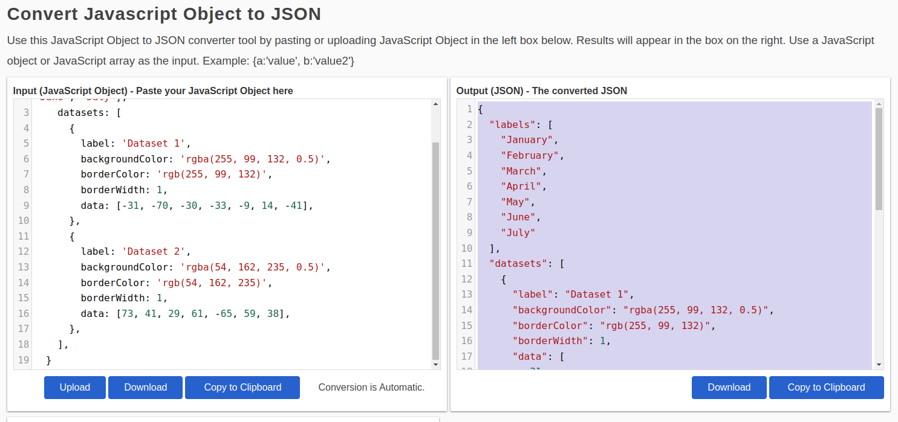

# Generate Chart Block Settings

## How to generate charts

* Open [this app](https://app.mindstudio.ai/ais/f44520ff-8d0f-4068-95ea-a0c59293d067/use)
* Sample charts are hardcoded and automatically generated
* For manual:
  * Choose a chart type (bar, line or pie are supported for now)
  * Go to [https://quickchart.io/gallery/](https://quickchart.io/gallery/)
  * Open a chart you like from the selected type
  * Copy **only the `data` part of the object like in the screenshot below**

<figure><figcaption></figcaption></figure>

* Paste it in [https://www.convertsimple.com/convert-javascript-to-json/](https://www.convertsimple.com/convert-javascript-to-json/) to convert it to proper JSON (some of the examples from that site are in JSON and some are plain JS objects. This ensures they’re all proper).
* Copy the output from the right side

<figure><figcaption></figcaption></figure>

* Paste it into the Manual input of the corresponding type inside the app
