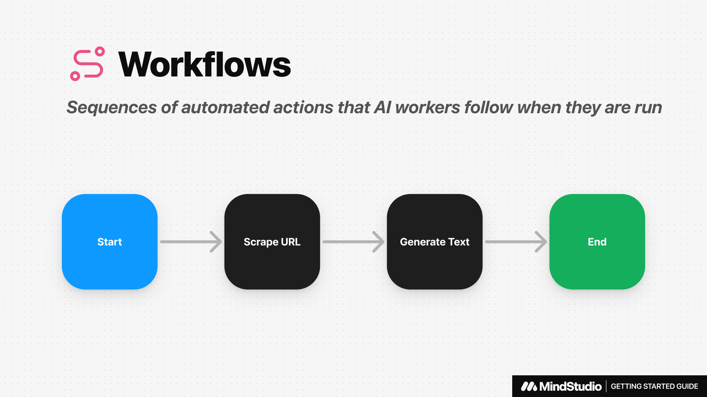

# Creating Workflows

## What is a Workflow?

Workflows are sequences of automated actions that your AI Agents follow when they are run.



## Designing Workflow Automations

After opening the **Automations Tab**, you’ll see the **Automations Canvas** which displays all of the individual actions that your workflow will execute when run. These are represented by **Blocks** on the canvas.

## **Best Practices for Designing Workflows**

* **Plan Before You Build**: Outline the steps your workflow will perform.
* **Use Helpful Variable Names**: Name variables descriptively to make the workflow easy to debug.
* **Test as You Go**: Regularly test each block to identify and resolve issues early. To test out the specific output of blocks that use AI, you may use the **Profiler** to compare results.

## Automations Canvas Controls

The canvas is infinitely scrollable in all directions. At the bottom of the canvas, you’ll find several controls to help you navigate and annotate the canvas as you design your Workflow.

### Panning Around the Canvas

**Using a mouse:**

* `Scroll` to pan up and down the canvas.
* `Shift + Scroll` to pan left and right across the canvas.

**Using the Pan Tool:**

*   Click the **Pan Tool icon** or use the `H` hotkey to activate the Pan Tool.

    
* Click and drag in any direction to pan around the canvas. **NOTE:** You will not be able to select blocks while the Pan tool is activated.
*   Click the **Select Tool icon** or use the `V` hotkey to deactivate the Pan Tool.

    

### Zooming In & Out

**Using a mouse:**

* On Mac, use `CMD + Scroll` to zoom in and out.
* On PC, use `CTRL + Scroll` to zoom in and out.

**Using the Zoom Controls:**

*   Click **Zoom In icon** or use the `+` hotkey to zoom in.

    
*   Click **Zoom out icon** or use the `-` hotkey to zoom out

    

### Centering the Canvas

If you navigate away from your blocks and can no longer find them, you can reset and center all of the blocks on the canvas by clicking the **Reset view icon** or using the `R` hotkey


### Auto Arrange Blocks

If your workflow becomes long and complex, you may want to consider tidying it up using **Auto arrange.** This tool will align all blocks vertically on the canvas.


### Adding Notes to the Canvas

You can annotate the canvas using the **Note Tool** to add text notes or label groups of blocks on.

**Using the Note Tool Controls:**

*   Click on the **Note tool icon** to create a new note

    
* Select the color of your note
* Click on the note and add text content to your note
* Add an optional label to the top of your note. If no text is added in the label, then it will not show a label.
* Click and drag the anchors found at each corner of the note to adjust the note size.

### Add a New Block to the Workflow

**Between Existing Blocks:**

* Select the `+` button between to connected blocks to open up the **Block Menu**.
* Select the block that you’d like to add.
* The new block will be automatically connected between the two blocks.

**Anywhere on the Automations Canvas:**

* Right-click anywhere on the canvas to open the **Block Menu**.
* `CTRL + Click` anywhere on the canvas to open the **Block Menu**.

### Deleting a Block

* Click on the delete icon at the top-right corner of any block.
* Confirm the delete action.

## Key Components of a Workflow

### **The Start Block**

This block initializes the workflow. It can be triggered on demand or on a defined schedule, and allows you to define launch variables, which provide dynamic values that are passed through the workflow.

### **Workflow Blocks**

There are many kinds of blocks that you can add to your workflow. All blocks will have different configuration options depending on the block that you select.

Types of blocks include:

* **AI Tools**: Generate text, generate images, analyze image, etc.
* **Context Blocks**: Gather context for the AI. Context is saved to a variable.
* **Routing Blocks**: Add conditional branches to route the workflow in various ways. \</aside>

### **Terminator Blocks**

This block marks the end of the workflow. It has customizable end behavior, such as sending email notifications or returning a structured output.

## Defining and Calling Variables

Variables in MindStudio are dynamic placeholders that store data during workflow execution. They allow you to pass information between blocks and workflows seamlessly.

### **Defining Variables**

1. **Launch Variables:** These are defined in the **Start Block** of your workflow.
2. **Runtime Variables:** Some blocks, such as Generate Text Blocks or User Input Blocks, can generate new variables while the workflow is running. For Example, after performing a Google Search, the block can store the results in a variable called <mark style="color:red;">`google_result`</mark>.

### **Calling Variables**

To use a variable in any block, reference it using double curly braces: <mark style="color:red;">`{{variable_name}}`</mark>.

**Generate Text prompt example calling a variable:**

```
Summarize the following info: {{google_result}}
```
