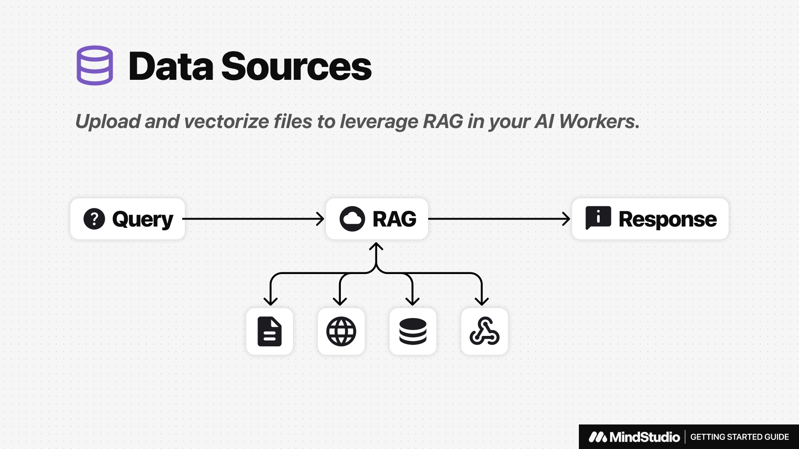
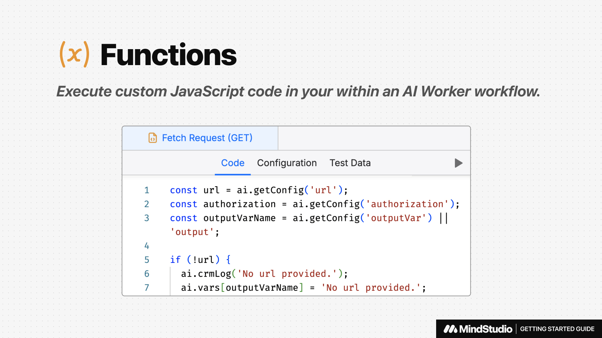
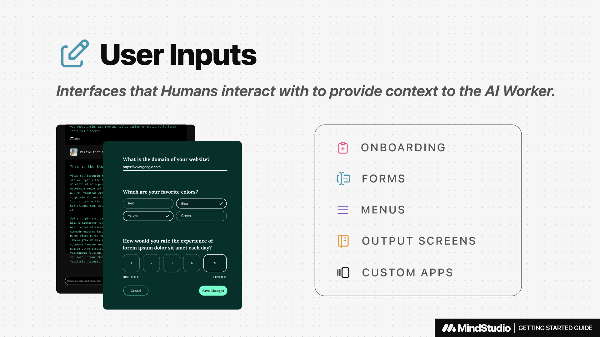

# Editor Overview



After creating a new AI Agent, you’ll land in the MindStudio Editor. The editor is made of two key areas: the **Explorer** and the **Navigator** (commonly referred to as the **Workspace Area**).

### **Explorer Tab**

On the left you’ll find the **Explorer Tab.** This is where you'll find all of the resources used to build your AI Agents.

<figure><figcaption></figcaption></figure>

### Types of Resources

#### **Data Sources**

Upload and vectorize files to leverage Retrieval Augmented Generation (RAG) in your AI workflows.

Learn more about Data Sources →

#### **Functions**

Execute JavaScript code in your workflow.

Learn more about Functions →

#### **User Inputs**

Interfaces that humans interact with to provide context to the AI Agent.

Learn more about User Inputs →

#### **Workflows**&#x20;

Sequences of automated actions that your AI Agents follow when they are run.

Learn more about Workflows →

### Navigator

The large area covering the rest of the Editor if the Main Workspace, also refer to as the **Navigator**. This area will change depending on what you have selected. By default, the Editor will open on the `Main.flow` workflow and have the **Prompt Tab** open.

<figure><figcaption></figcaption></figure>

### Additional Global Controls

#### Top Bar

The Top Bar in the Editor contains the following controls:

* **Back Button:** Navigates to the Workspace Overview Screen
* **Title:** Access general AI Agent Settings
* **Preview Button:** Opens a draft preview of the AI Agent
* **Publish Button:** Saves and deploys all changes to the AI Agent

#### Bottom Bar

The bottom bar of the Editor contains the following controls:

* **Workspace Name:** Click to access workspace settings
* **Help & Support:** Access video tutorials, documentation, and live support chat
* **Collapse Controls:** Opens and closes the left and right columns of the Editor
