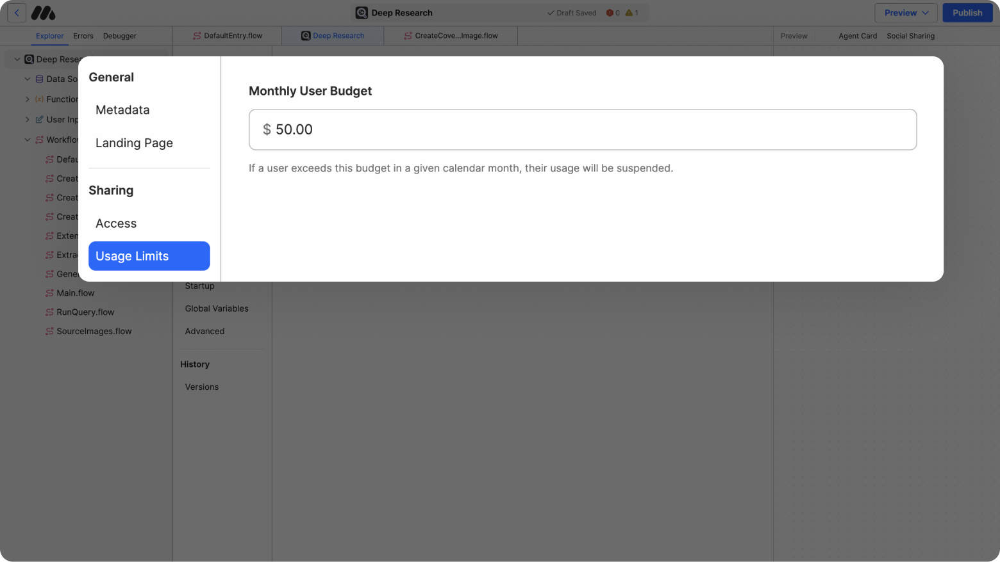
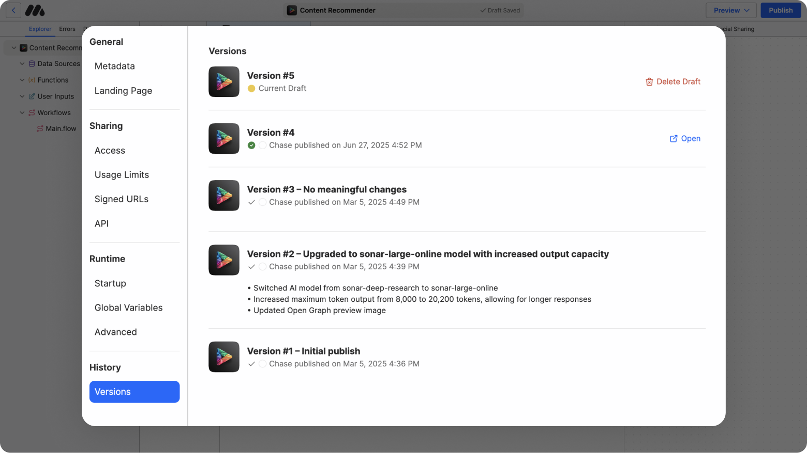

# Publishing & Versioning

**Publishing** is the last step in preparing an AI Agent for deployment. In this article, we’ll cover all of the AI Agent Settings you can configure before publishing your AI Agent.

## **Publishing an AI Agent**

Publishing creates a versioned release of your AI Agent, locking in its current configuration. Once published, this version becomes accessible to users and collaborators.

#### **Steps to Publish**

1. Review the AI Agent’s metadata and configuration for accuracy.
2. Click the **Publish** button in the top-right corner.
3. Open the current version of your AI Agent.

<figure><figcaption></figcaption></figure>

**Note:** Before publishing, ensure you've opened up the AI Agent Settings and verified all metadata fields are correctly configured. This includes checking the name, description, API function name, icons, usage limits, and sharing settings.

***

## AI Agent Settings

AI Agent Settings provide configuration options for customizing, controlling, and managing your AI Agent. These settings are organized into several key sections that allow you to define everything from adding basic metadata (like name and description) to usage limits and sharing permissions.

Properly configuring these settings is crucial for ensuring your AI Agent functions as intended and is accessible to the right users.

#### Accessing AI Agent Settings

1. Navigate to the **Explorer Tab** on the left.
2. Click on the Root File at the top of the Explorer Tab to open the AI Agent Settings

### **General Settings**

Under the **General** section, you will define key metadata and identifiers for your AI Agent. Make sure AI Agent is properly named, described, and configured for external integration.

#### **Metadata**

1. **Name:** Enter a clear and concise name for your AI Agent. This name is displayed throughout the MindStudio platform and in shared links.
2. **Short Description:** Provide a brief description of your AI Agent’s purpose and functionality. This helps collaborators and end-users understand its role at a glance.
3. **API Function Name (Optional)**: Specify a custom API function name if you plan to invoke the AI Agent programmatically via the MindStudio NPM package. This is particularly useful for integrating the AI Agent into larger systems.
4. **Agent Icon:** Upload an image to serve as the primary icon for your AI Agent. This icon is displayed in the MindStudio interface and associated with the AI Agent in all contexts.
   * **Recommended Size**: 500x500 pixels.
   * **File Types Supported**: PNG, JPEG
5. **Agent ID:** A unique identifier automatically assigned to your AI Agent. This ID is used for backend and API integration purposes. Click the copy icon to copy the Agent ID for use in development or debugging.

<figure><figcaption></figcaption></figure>

#### **Landing Page**

This section allows you to create a detailed landing page for your AI agent.

1. **Display Name :** This will be the name displayed on the landing page for the AI agent. By default, it will use the name created in **Metadata.**
2. **Subtitle**: Create short subtitle to be featured underneath the display name.&#x20;
3. **Functional Description:** Create a simple description that explains what the agent does and how it works.
4. **Full Description:** Created a full detailed description of your AI agent. Use **markdown formatting** to add numbers, bullet points, headers and more.&#x20;
5. **Tags:** Add **tags** to your landing page to optimize SEO. _This section is optional._&#x20;
6. **Video Tutorial:** Upload a **video tutorial** that will displayed at the top of your landing page. _This section is optional._&#x20;
7. **Sample Assets**: Link any **sample assets** to show others what the output of your agent might look like. _This section is optional._&#x20;
8. **Social Sharing Image:** Upload an image that will be displayed the link to your AI agent is shared. Recommended size is **1200x630.**

<figure><figcaption></figcaption></figure>

***

### **Sharing Settings**

The Sharing settings allow you to configure how your AI Agent can be accessed and shared with others.

#### Access

1. **Public Use:** Enabling this setting allows anyone to run the agent without making their own copy.&#x20;
2. **Remixing:** When enabled, others can create a copy of your AI Agent and modify it to build their own version. **Remixing is enabled by default.** Enabling this setting makes your AI Agent publicly remixable by anyone.
3. **Cost Responsibility:** Choose who is responsible for the compute costs of the agent running. The owner of the agent is selected by default. This feature can only be viewed if **public use** is enabled.&#x20;

<figure><figcaption></figcaption></figure>

#### Usage Limits

1. **Monthly User Budget:** Define a spending cap for individual users interacting with the AI Agent. If a user exceeds this limit within a calendar month, their access will be suspended for that period.
   * **Example:** Set this value to $10 to limit each user’s spending to $10 per month.

<figure><figcaption></figcaption></figure>

#### Signed URLs

1. **Managed Users:** Allows you to create and manage a unique ID for certain users so they do not need to sign up for a MindStudio account to use an embedded agent.&#x20;
2. **Create with API (Recommended):** Provides the embed code to use MindStudio's API to managed and create signed URLs. Make a request to your backend using the users unique ID.
3. **Guest Access (Not recommended):** Provides the embed code to allow direct access to the AI agent. Guest users will have limited access to their run history, and their runs may be erased without notice depending on their browser settings. You will not be able to manage users and are responsible for all usage costs.&#x20;
4. **API:** Gives access to the [API Request builder.](../developers/api-reference.md)

<figure><figcaption></figcaption></figure>

***

### Runtime Settings

#### Start Up

1. **Entry Workflow:** Select the workflow from which the agent should start. By default, <mark style="color:red;">`Main.flow`</mark> will always be selected.&#x20;
2. **Onboarding:** Add and configure onboarding user inputs. These inputs will be displayed the first time a user runs the agent. These variables are set globally and will be available in all agent runs.&#x20;

#### Global Variables&#x20;

Create global variables for any AI agent that can be set or accessed within any run.&#x20;

#### Advanced

1. **Maximum Operations per Invocation:** This setting controls the number of steps that can be executed in a single invocation. An invocation is an API request, new run, or a manual continuation of a run by a user (e.g., clicking “Next” in a workflow). This setting exists to protect you from runaway processes and infinite loops. Be careful adjusting it.
2. **Transfer Ownership:** Allows you to reassign ownership of an AI Agent to a different workspace. This is particularly useful when moving AI Agents between personal and organizational workspaces or consolidating assets under a specific team.

***

### **Versions**

The **Versions** tab provides a comprehensive history of your AI Agent’s lifecycle, allowing you to manage and track both drafts and published versions effectively.

<figure><figcaption></figcaption></figure>

#### **Published Versions**

Displays a list of all previously published versions, sorted chronologically.

**Metadata:**

* **Version Name**: Helps identify specific releases (e.g., Version #1, Version #2).
* **Publisher's Name**: Identifies who published the version.
* **Timestamp**: Shows the exact time of publication.
* **Change log:** AI generated list of changes

**Controls:**

* **Open**: Click to view the current published version of the AI Agent.
* **Restore Version:** Visible on hover. Replaces the live version with the selected version and deletes any changes made to the draft.

#### **Draft Versions**

Lists the current draft version under development. Any changes you make to your project before publishing a new version are saved to this draft.

* **Delete Draft**: Removes all changes made to the current draft and restores settings to current published version.

#### **Version Statuses**

* **Drafts (yellow icon):** Represents ongoing work.
* **Published Versions (green checkmark):** Indicates live and accessible versions.
* **Older Versions (gray checkmark):** Indicates previously published versions.
