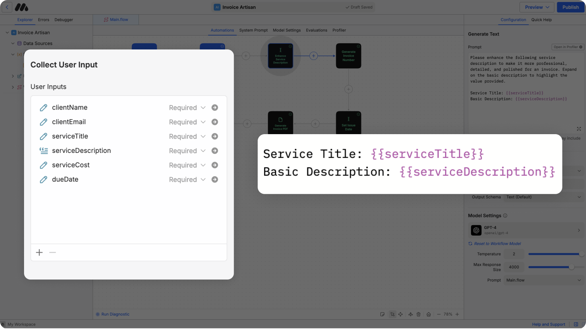

# Variables



Variables in MindStudio are dynamic placeholders that store data during workflow execution. They allow you to pass information between blocks and workflows seamlessly.

**Example:**

* Variable Name: `userName`
* Usage: `"Hello {{username}}! Welcome to our app."`&#x20;

***

## **Types of Variables**

#### **Runtime Variables**

Most blocks, such as **Generate Text Blocks** or **User Input Blocks**, assign values for the variable while the workflow is running. For Example, after performing a Google Search, the block can store the results in a variable called `google_result`.

<figure><figcaption></figcaption></figure>

#### **Launch Variables**

These are defined in the **Start Block** of your workflow. Values for these variables are passed in as arguments when a workflow is run via API or via the Run Workflow block.

<figure><figcaption></figcaption></figure>

#### **Global Variables**

These variables values are scoped to the agent and stored in between Agent Runs. They are assigned in the onboarding flow or can be defined in blocks using `global.myVariable` syntax.

<figure><figcaption></figcaption></figure>

#### User Variables

These variable values are scoped specifically to the user as the agent runs and are stor

***

## Creating Variables

Variables are created automatically in MindStudio whenever:

* A [**User Input**](variables.md#user-inputs) collects data.
* A block generates an output (e.g., [**Generate Text Block**](blocks-reference/generate-text-block.md), [**Analyze Image Block**](blocks-reference/analyze-image-block.md)).
* You manually define them in the [**Start Block**](blocks-reference/start-block.md).

***

### Using Variables

To use a variable in any block or prompt, reference it by enclosing the variable name in double curly braces: `{{variable_name}}`.

**Example Using Variables in a Generate Text Block**:

```markdown
Summarize the article titled "{{articleTitle}}". 

In the summary, make sure to write about the following topic: 
{{topic}}
```

***

### Tips for Working with Large Variables

Variables are replaced with their values before the text is sent to the AI model. You must make sure your message will be coherent and legible after the variables have been substituted with their values. For longer variables, this means using things like XML tags to offset variable content from instructions.

**Incorrect:**

```
Summarize this article {{articleContent}} and find all mentions of {{personName}}.
```

This pattern does not work because `{{articleContent}}` will be replaced with the raw text or HTML of an article. If you execute this prompt and view its logs in the [Debugger](../test-and-evaluate/debugger.md), you will see that what is sent to the model is a giant sentence like "Summarize this article The history of lorem ipsum has long been thought to contain dolor sit amet \[...1000 more words from the article directly pasted in] and find all mentions of Taylor Swift".&#x20;

While AI models are great at parsing text, using simple formatting can make prompts dramatically more effective, as well as easier for you to maintain.

**Correct:**

```
<article_content>
{{articleContent}}
</article_content>

Using the provided article content, create a summary of the article as well as a list of all mentions of {{personName}}.
```

Offsetting with XML-style tags (it doesn't matter what the actual tags are, you can make up anything you like as long as it makes sense) helps the model understand which aspects of your prompt are instructions and which are context. [Anthropic](https://docs.anthropic.com/en/docs/build-with-claude/prompt-engineering/long-context-tips#example-quote-extraction) found that placing long variables at the top of the prompt using XML tags improved response quality by up to 30%.

To achieve best results, you should strive to make your prompt as easy to read for a human as possible. A handy test is to imagine that you were to print out your prompt on paper (after all variables have been substituted) and give it to someone. Would they be able to understand what you want them to do? Or would it look like gibberish?

MindStudio leverages the [**Handlebars templating language**](https://handlebarsjs.com/guide/expressions.html#basic-usage) to make working with variables intuitive and powerful. Handlebars allows you to include, manipulate, and conditionally render data directly in your prompts, outputs, and logic.

***

## Using Handlebars Templating

MindStudio leverages the [**Handlebars templating language**](https://handlebarsjs.com/guide/expressions.html#basic-usage) to make working with variables intuitive and powerful. Handlebars allows you to include, manipulate, and conditionally render data directly in your prompts, outputs, and logic.

### **Conditional Logic**

Handlebars supports `if-else` logic for dynamic outputs, as well as other control expressions. **For a full list of expressions, visit the** [**Handlebars Documentation**](https://handlebarsjs.com/guide/expressions.html#basic-usage) **site.**

```markdown
{{#if userName}}
Hello, {{userName}}! How can we assist you today?
{{else}}
Hello! Please log in to get started.
{{/if}}
```

***

#### <mark style="color:red;">`{{#if condition}}`</mark>

Converts a conditional block that renders content only when the condition is true.

Example:

If `isLoggedIn` is true

**Usage:**

```handlebars
{{#if isLoggedIn}}
  Welcome back!
{{/if}}
```

**Output:**

```handlebars
Welcome back!
```

***

#### <mark style="color:red;">`{{#unless condition}}`</mark>

Converts a conditional block that renders content only when the condition is false.

**Example:**

If `isLoggedIn` is false

**Usage:**

```handlebars
{{#unless isLoggedIn}}
  Please sign in.
{{/unless}}
```

**Output:**

```handlebars
Please sign in.
```

***

#### <mark style="color:red;">`{{#each array}}`</mark>

Iterates over an array or object and renders the block for every item.

**Example:**

If `items` contains:

```handlebars
["Apple", "Banana", "Cherry"]
```

**Usage:**

```handlebars
{{#each items}}
  {{this}}
{{/each}}
```

**Output:**

```handlebars
opyApple
Banana
Cherry
```

***

#### <mark style="color:red;">`{{#with object}}`</mark>

Changes the evaluation context to the provided object for the enclosed block.

**Example:**

If `user` contains:

```handlebars
{ "name": "Alice", "age": 25 }
```

**Usage:**

```handlebars
{{#with user}}
  {{name}} is {{age}} years old.
{{/with}}
```

**Output:**

```handlebars
Alice is 25 years old.
```

***

### **Special Handlebars Methods in MindStudio**

In addition to standard Handlebars features, MindStudio introduces special methods for advanced functionality:

#### <mark style="color:red;">**`{{json varName}}`**</mark>

Converts a JSON object into a string format.

**Example**:

If `userProfile` contains:

```json
{
    "name": "John",
    "age": 30
}
```

**Usage:**

```
{{json userProfile}}
```

**Output:**

```json
{"name":"John","age":30}
```

***

#### <mark style="color:red;">**`{{sample varName number token}}`**</mark>

Extracts a portion of the variable's content based on specified parameters.

* **Parameters**:
  * **varName**: The variable to sample.
  * **number**: The number of items (e.g., lines, words, or letters). If negative, starts from the end.
  * **token**: The type of unit to extract (`line`, `word`, or `letter`).
* **Examples**:
  *   Extract the first 5 words:

      ```handlebars
      {{sample textVar 5 "word"}}
      ```
  *   Extract the last 3 lines:

      ```handlebars
      {{sample textVar -3 "line"}}
      ```
  *   Extract the first 10 letters:

      ```handlebars
      {{sample textVar 10 "letter"}}
      ```

***

#### <mark style="color:red;">`{{lookup object key}}`</mark>

Dynamically looks up a property from an object using a key.

**Example:**

If `user` contains:

```handlebars
{ "name": "Alice", "role": "admin" }
```

Usage:

```handlebars
{{lookup user "role"}}
```

Output:

```handlebars
admin
```

***

#### <mark style="color:red;">`{{get varName "property"}}`</mark>

Retrieves a nested property using a JSONPath expression from a JSON object.

**Example:**

If **`userData`**&#x63;ontains:

```handlebars
{
  "name": "Alice",
  "contact": { "email": "alice@example.com" }
}
```

**Usage:**

```handlebars
{{get userData "$.contact.email"}}
```

**Output:**

```handlebars
alice@example.com
```

***

#### <mark style="color:red;">`{{add num increment}}`</mark>

Adds a numeric increment to a given number.

**Example:**

If `num` is:

```handlebars
5
```

**Usage:**

```handlebars
{{add 5 3}}
```

**Output:**

```handlebars
8
```

***

#### <mark style="color:red;">`{{subtract num decrement}}`</mark>

Subtracts a numeric value from a given number.

**Example**:

If `num` is:

```handlebars
10
```

**Usage:**

```handlebars
{{subtract 10 4}}
```

**Output:**

```handlebars
6
```

***

#### <mark style="color:red;">`{{multiply value multiplier}}`</mark>

Multiplies two numbers.

**Example:**

If `value` is:

```
2
```

**Usage:**

```
{{multiply 2 5}}
```

**Output:**

```
10
```

***

#### <mark style="color:red;">`{{divide dividend divisor}}`</mark>

Divides one number by another.

**Example:**

If `dividend` is:

```handlebars
10
```

**Usage:**

```handlebars
{{divide 10 2}}
```

**Output:**

```handlebars
5
```

***

#### <mark style="color:red;">`{{eq var1 var2}}`</mark>

Checks if two values are equal using the double-equals operator.

**Example:**

If `var1` contains:

```handlebars
5
```

and `var2` contains:

```handlebars
"5"
```

**Usage:**

```handlebars
{{eq 5 "5"}}
```

**Output:**

```handlebars
true
```

***

#### <mark style="color:red;">`{{gt value1 value2}}`</mark>

Checks if the first value is greater than the second value.

**Example:**

If `value1` is:

```handlebars
10
```

and `value2` is:

```handlebars
5
```

**Usage:**

```handlebars
{{gt 10 5}}
```

**Output:**

```handlebars
true
```

***

#### <mark style="color:red;">`{{gte value1 value2}}`</mark>

Checks if the first value is greater than or equal to the second value.

**Example:**

If `value1` is:

```handlebars
10
```

and **value2** is:

```handlebars
10
```

**Usage:**

```handlebars
{{gte 10 10}}
```

**Output:**

```handlebars
true
```

***

#### <mark style="color:red;">`{{lt value1 value2}}`</mark>

Checks if the first value is less than the second value.

**Example:**

If `value1` is:

```handlebars
5
```

and `value2` is:

```handlebars
10
```

**Usage:**

```handlebars
{{lt 5 10}}
```

**Output:**

```handlebars
true
```

***

#### <mark style="color:red;">`{{lte value1 value2}}`</mark>

Checks if the first value is less than or equal to the second value.

**Example:**

If `value1` is:

```handlebars
5
```

and `value2` is:

```handlebars
5
```

**Usage:**

```handlebars
{{lte 5 5}}
```

**Output:**

```handlebars
true
```

***

#### <mark style="color:red;">`{{isEmpty varName}}`</mark>

Evaluates whether a variable is empty (null, undefined, an empty string, an empty array, or an empty object).

**Example:**

If `data` contains:

```handlebars
""
```

Usage:

```handlebars
{{isEmpty data}}
```

Output:

```handlebars
true
```

***

#### <mark style="color:red;">`{{length varName}}`</mark>

Returns the length of an array or a string. Returns "NaN" if the variable is not an array or string.

**Example:**

If `list` contains:

```handlebars
["a", "b", "c"]
```

**Usage:**

```handlebars
{{length list}}
```

**Output:**

```handlebars
3
```

***

#### <mark style="color:red;">`{{itemAt varName index}}`</mark>

Return an item from an array.

**Example:**

If `list` contains:

```
["a", "b", "c"]
```

**Usage:**

```
{{itemAt list 1}}
```

**Output:**

```
b
```

_Note that the first item in an array is always index `0`._

***

#### <mark style="color:red;">`{{firstItem varName}}`</mark>

Return the first item from an array.

**Example:**

If `list` contains:

```
["a", "b", "c"]
```

**Usage:**

```
{{firstItem list}}
```

**Output:**

```
a
```

***

#### <mark style="color:red;">`{{lastItem varName}}`</mark>

Return the last item from an array.

**Example:**

If `list` contains:

```
["a", "b", "c"]
```

**Usage:**

```
{{lastItem list}}
```

**Output:**

```
c
```

***

#### <mark style="color:red;">`{{markdown varName}}`</mark>

Converts a Markdown-formatted string into HTML.

**Example:**

If `markdownText` contains:

```markdown
# Hello World
This is **bold** text.
```

**Usage:**

```handlebars
{{markdown markdownText}}
```

**Output:**

```html
<h1>Hello World</h1>
<p>This is <strong>bold</strong> text.</p>
```

***

#### <mark style="color:red;">`{{formattedNumber number fractionDigits}}`</mark>

Formats a number using locale‑specific formatting with a fixed number of fractional digits.

**Example:**

If `amount` is:

```handlebars
1234.567
```

**Usage:**

```handlebars
{{formattedNumber 1234.567 2}}
```

**Output:**

```handlebars
1,234.57
```

***

#### <mark style="color:red;">`{{abbreviatedNumber number fractionDigits}}`</mark>

Formats a number into a compact, abbreviated notation (e.g., 1K, 1M) with a specified number of fractional digits.

**Example:**

If `amount` is:

```handlebars
1500
```

**Usage:**

```handlebars
{{abbreviatedNumber 1500 1}}
```

**Output:**

```handlebars
1.5k
```

***

#### <mark style="color:red;">`{{date varName format}}`</mark>

Formats a date string according to the specified format. Supports both custom formats (e.g., "YYYY-MM-DD") and relative keywords like "fromNow" or "toNow". Any [Moment.js-compatible](https://momentjs.com/docs/#/displaying/format/) date format can be used.

**Example:**

If `dateString` contains:

```handlebars
2020-01-01T00:00:00Z
```

**Usage:**

```handlebars
{{date dateString "YYYY-MM-DD"}}
```

**Output:**

```handlebars
2020-01-01
```

You can also format the current date by using `currentDate` as the variable:

**Usage:**

```handlebars
{{date currentDate "dddd, MMMM Do YYYY, h:mm:ss a"}}
```

**Output:**

<pre class="language-handlebars"><code class="lang-handlebars"><strong>Monday, June 9th 2025, 3:25:50 pm
</strong></code></pre>

***

#### <mark style="color:red;">`{{dateAdd date amount unit}}`</mark>

Add a specified amount of time to a given date. Date can be currentDate or a any [Moment.js-compatible](https://momentjs.com/docs/#/displaying/format/) date string. Amount must be a number. Unit must be a [Moment.js-compatible](https://momentjs.com/docs/#/manipulating/add/) unit.

**Example:**

**Usage:**

```handlebars
{{dateAdd currentDate 3 "days"}}
```

**Output:**

```handlebars
2025-07-12T17:01:00.000Z
```

You can use `dateAdd` as a nested expression inside a date formtter:

**Usage:**

```handlebars
{{date (dateAdd currentDate 3 "days") "dddd, MMMM Do YYYY, h:mm:ss a"}}
```

**Output:**

```handlebars
Saturday, July 12th 2025, 5:02:00 pm
```

***

#### <mark style="color:red;">`{{dateSubtract date amount unit}}`</mark>

Subtract a specified amount of time from a given date. Date can be currentDate or a any [Moment.js-compatible](https://momentjs.com/docs/#/displaying/format/) date string. Amount must be a number. Unit must be a [Moment.js-compatible](https://momentjs.com/docs/#/manipulating/add/) unit.

**Example:**

**Usage:**

```handlebars
{{dateSubtract currentDate 3 "days"}}
```

**Output:**

```handlebars
2025-07-06T17:01:00.000Z
```

You can use `dateSubtract` as a nested expression inside a date formtter:

**Usage:**

```handlebars
{{date (dateSubtract currentDate 3 "days") "dddd, MMMM Do YYYY, h:mm:ss a"}}
```

**Output:**

```handlebars
Saturday, July 6th 2025, 5:02:00 pm
```
