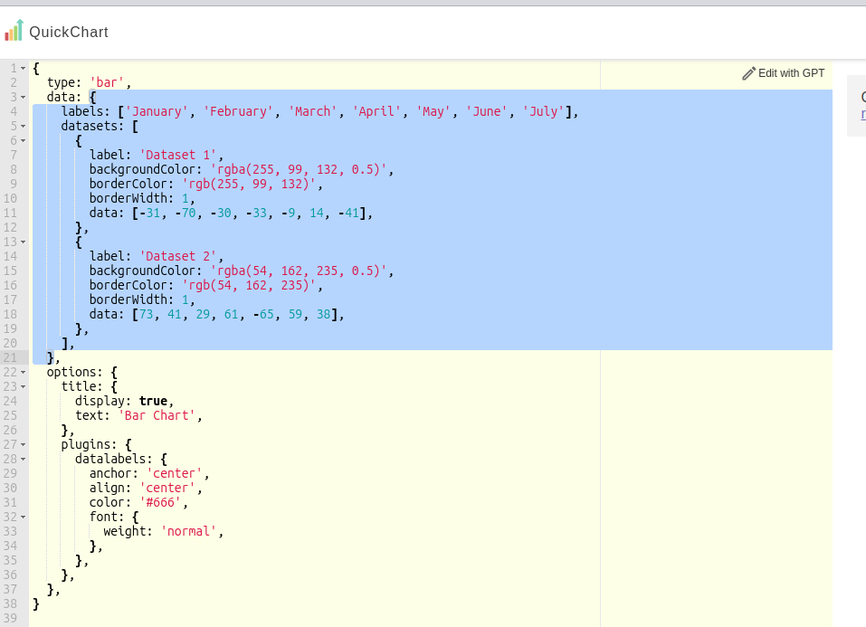

# Generate Chart Block

The **Generate Chart Block** creates a chart image based on JSON-formatted data, allowing you to dynamically generate visualizations in your workflows. The resulting image URL can be saved as a variable for further use in the workflow.

## Configurations

### **Chart Data**

Provide the data for the chart in valid JSON format. This must follow the `data` object structure as used in Chart.js.

### **Width and Height**

Specify the dimensions of the chart in pixels:

* **Width**: The horizontal size of the chart.
* **Height**: The vertical size of the chart.

Default dimensions are 500x300.

### **Output Variable**

Creates a new variable and saves the chart image URL to it. Enter a `variable_name` \*\*\*\*to store the image URL for later use in the workflow.

## How to Generate Chart Data

### **1. Select a Chart Template**

Visit [QuickChart Gallery](https://quickchart.io/gallery/), where you can browse a variety of chart examples. Open a chart you like, then locate the `data` object in the chart configuration.

### **2. Copy the `data` Object**

Only copy the portion labeled as `data` from the chart’s JSON.



### **3. Convert to JSON**

Some chart examples are provided in plain JavaScript objects instead of JSON. To ensure compatibility:

1. Paste the `data` object into [ConvertSimple: JavaScript to JSON Converter](https://www.convertsimple.com/convert-javascript-to-json/).
2. Review the output on the right side to confirm proper JSON formatting.
3. Copy to Clipboard.

#### Example JSON Data for a Bar Chart:

```json
{
  "labels": [
    "January",
    "February",
    "March",
    "April",
    "May",
    "June",
    "July"
  ],
  "datasets": [
    {
      "label": "Dataset 1",
      "backgroundColor": "rgba(255, 99, 132, 0.5)",
      "borderColor": "rgb(255, 99, 132)",
      "borderWidth": 1,
      "data": [
        -31,
        -70,
        -30,
        -33,
        -9,
        14,
        -41
      ]
    },
    {
      "label": "Dataset 2",
      "backgroundColor": "rgba(54, 162, 235, 0.5)",
      "borderColor": "rgb(54, 162, 235)",
      "borderWidth": 1,
      "data": [
        73,
        41,
        29,
        61,
        -65,
        59,
        38
      ]
    }
  ]
}
```

### **4. Paste `JSON` into the Chart Data Configuration**

* Open the **Manual Input** field for the corresponding chart type inside the app.
* Paste the converted JSON data into the **Chart Data** configuration.

[View Chart.js Docs to learn more about generating JSON for your charts →](https://www.chartjs.org/docs/2.9.4/charts/)
