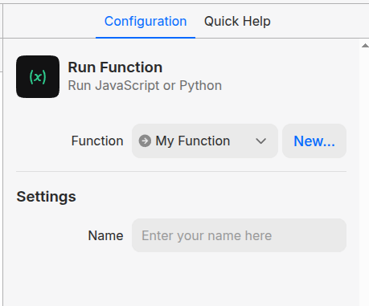

# Custom Workflow Functions

**Functions** in MindStudio empower you to extend the capabilities of your workflows by running JavaScript or Python code directly within your automation. Functions are created within the Editor and are executed in a workflow via the Run Function Block.

When working with the **Function Tab** in MindStudio, the interface is designed to to write and test code, and supports dynamic inputs, configurations, and debugging features to ensure smooth execution.



## Create a New Function

There are two primary ways to create a new function in MindStudio. Both approaches will create a new function in your Functions Folder, and open a blank function editor where you can specify the environment, write your code, configure inputs, and test the function.

#### From the Explorer

1. Navigate to the **Explorer** panel on the left-hand side of the editor.
2. Hover over the **Functions** folder.
3. Click the **+** button or right-click and select **New Function**.
4. A new function tab will open where you can begin writing your custom code.

#### From the Run Function Block

1. Add a **Run Function Block** to your workflow.
2. In the block configuration, click **New...** to create a new function.
3. A new function tab will open, allowing you to define and configure the function.

***

## Function Setup

Functions in MindStudio can be written in either **JavaScript** or **Python**, giving you flexibility to choose the language that best suits your needs. The function editor provides a modern development environment with syntax highlighting, auto-completion, and real-time error checking.

### 1. Configure Function Details

These details are displayed in the **Function Details** panel on the right. Provide a **Name** and optional **Description** for your function. Then select the programming environment for your function: **JavaScript** (Node.js) or **Python**.

**Note:** For Python functions, you can import external libraries to extend functionality.

### 2. Write the Function

Use the **Code Tab** to write the logic for your function. Utilize the available methods (see reference table below) to integrate your function seamlessly with configurations.

### 3. (Optional) Create Configurations

Use the **Configurations Tab** to define JSON for customizable settings that users can modify when implementing your function in their workflows. These settings can include input fields, drop-downs, toggles, and other UI elements that make your function more flexible and user-friendly.

## Code Tab

The **Code Tab** is the central workspace for writing the logic of your function. Here, you can write code in either JavaScript or Python, depending on the selected environment. The editor features syntax highlighting, making the code more readable and easier to debug.

[See available methods](custom-workflow-functions.md#available-methods)

## Configuration Tab

The **Configuration Tab** enables developers to define a configuration JSON file for their function. This JSON allows you to set up customizable settings, such as text inputs, drop-downs, or other UI elements, that non-technical users can configure with when they add the function to the **Run Function Block** in workflows.

### Configuration JSON Structure


```javascript
config = {
	thumbnailUrl: "URL" 
	//(Optional) Reference image used in the Community Functions menu.
	
	blockStyle: { 
	//(Optional) Used to override default Automation Canvas block styles 
	
		backgroundImageUrl: "URL",  
		//Displays an image as the background of the block. Overrides background color.
		
		backgroundColor: "#HEXCOD",
		//Defines the background color of the block. Requires a hexcode or HTML color name
		
		foregroundColor: "#HEXCOD",
		//Defines the color of the label text. Requires a hexcode or HTML color name
		
		label: "BLOCK NAME"
		//Sets the text label string 
	},
	
	configurationSections: [
	//(Optional) Creates configuration fields for the block. These are the settings that someone fills in on the right hand panel in the Automation Canvas
	
		{
			"title": "HEADER LABEL",
			//Defines the string for the section title
			
			"items": [
			//Each item object is an individual UI element added to config settings
				{
					"label": "LABEL TEXT", 
					//Defines item label
					
					"variable": "VARIABLE_NAME",
					//Assigns value to a variable for use in the Code Tab.
					
					"type": "INPUT TYPE"
					//Defines the input type.
						//"text" = Form field
						//"inputVariable" = A {{variable}} from the workflow
						//"outputVariableName" = A variable name to assign some output to
						//"secret" = Form field with hidden text. Does not transfer on remix.
						//"select" = Dropdown menu
						//"map" = Creates input for key:value pairs
						//"dataSource" = Dropdown menu to select a data source
						//"transition" = Allows users to select a block for dynamic transitions, similar to menu or logic block
	
					
					selectOptions: [
					//Only use when using "select" input type.
						{
							label: "OPTION 1"
							value: "VALUE TO ASSIGN"
						},
						{
							label: "OPTION 2"
							value: "VALUE TO ASSIGN"
						}
					],
					
					helpText: "STRING"
					//Defines helper text that appears under the input.
					
					textOptions: {
						textType: "TYPE"
							//Resizes form field. 
								//"default" = single line
								//"multiline" = textarea
					}
				}
			],
		}
	]
}
```


## Test Data Tab

The **Test Data Tab** is a dedicated space for verifying the behavior of your function with predefined inputs. You can simulate runtime variables such as `ai.vars` and `ai.config` by defining mock data to test different scenarios.&#x20;

Data defined in the **Test Tab** will be used when executing the function with the **Test** button in the bottom right of your code editor.

This feature allows you to ensure that your function behaves as expected without needing to integrate it into a full workflow.

### Test Data JSON Structure

```javascript
environment = {
  vars: {
    // Variables in your workflow
    myVariable: "This is a variable",
  },
  config: {
    // Variables configured by block settings
    myConfigProperty: "This is a config property",
  },
}
```

The above JSON structure will allow you to read the following variable and config values when testing:

<pre class="language-javascript"><code class="lang-javascript"><strong>console.log(ai.vars.myVariable); // "This is a variable"
</strong>console.log(ai.config.myConfigProperty); // "This is a config property"
</code></pre>

## Right Hand Panel Controls

### **Function Details Panel**

Displays key information about your function. Here, you can set the function’s name and description, which will be used to identify it in the **Run Function Block**. You can also select the environment—either JavaScript (Node.js) or Python—for your function.

### Configuration Preview

Live preview of the configuration interface, giving you immediate feedback on how your JSON structure set the Configuration Tab will appear to users when they edit the block.

### Quick Help Tab

Built-in reference guide. Displays the guide relevant to what you are editing.

## Available Methods <a href="#available-methods" id="available-methods"></a>

#### [More information about Custom Function Methods here](custom-function-methods.md)

| Method                                                                                     | Description                                                                                                                                                                                                                                 |
| ------------------------------------------------------------------------------------------ | ------------------------------------------------------------------------------------------------------------------------------------------------------------------------------------------------------------------------------------------- |
| <h4><strong><code>ai.config</code></strong></h4>                                           | Object containing configuration variables defined in MindStudio                                                                                                                                                                             |
| <h4><strong><code>ai.vars</code></strong></h4>                                             | Object containing runtime variables defined by other functions or blocks.                                                                                                                                                                   |
| <h4><strong><code>ai.log(value)</code></strong></h4>                                       | Update the progress text for the user. If your function takes a long time to run, this can be helpful in communicating what is happening to the user.                                                                                       |
| <h4><strong><code>ai.scrapeUrl(url)</code></strong></h4>                                   | Scrape the contents of a URL and return an object containing the text extracted from the page, the raw HTML, and some structured metadata (page title, description, resolved URL, thumbnail image URL).                                     |
| <h4><strong><code>ai.searchGoogle(query)</code></strong></h4>                              | Search Google for a query and return the first page of results. Returns an object containing all the results as a block of text, as well as individually as an array of objects containing the title, description, and URL for each result. |
| <h4><strong><code>ai.queryDataSource(dataSourceId, query, numResults)</code></strong></h4> | Perform a query against a data source defined in a project. Returns a string result. If `numResults` is not provided, only one chunk will be returned.                                                                                      |
| <h4><strong><code>ai.uploadFile(body)</code></strong></h4>                                 | Upload a file and return a URL. File must be a valid Base 64 data URL.                                                                                                                                                                      |
| <h4><strong><code>ai.concatenateAudio(urls)</code></strong></h4>                           | Combine an array of URLs to audio files into one mp3.                                                                                                                                                                                       |
| <h4><strong><code>ai.concatenateVideo(urls)</code></strong></h4>                           | Combine an array of URLs to video files into one mp4.                                                                                                                                                                                       |

## Quick Examples

### Assigning value to a variable

* Get data from a Search Google function
* Assign that data to the variable `output`

#### JavaScript

```javascript
const searchData = await ai.searchGoogle("cats");
ai.vars.output = searchData;
```

#### Python

```python
ai["vars"]["searchResults"] = await ai["searchGoogle"]("cats")
print("Hello World?")
```

### Simple Input Field in Custom Function Config

<div align="left" data-full-width="false"><figure><figcaption></figcaption></figure></div>

Configuration Tab:

```javascript
config = {
  configurationSections: [
    {
      title: "Settings", // Title of the config section
      items: [
        {
          type: "text",
          label: "Name",
          variable: "name",
          placeholder: "Enter your name here"
        }
      ]
    }
  ],
}
```

Access the value of this input field in the code like so:

**JavaScript**

```javascript
const name = ai.config.name;
```

**Python**

```python
name = ai["config"]["name"]
```

## Execution Environments

### Sandbox

Sandbox is the default execution environment for custom functions. MindStudio's Sandbox is optimized for speed and performance and should be preferred for most functions. For JavaScript, the Sandbox uses [Isolates](https://github.com/laverdet/isolated-vm) to run your code in secure environments. Python code is evaluated using [Pyodide](https://pyodide.org/en/stable/). In most cases, these details do not matter and the Sandbox will happily run any code you provide it.

However, complex or advanced functionality, like installing NPM packages, is not supported in Sandbox Execution. For cases where you need the full power of NodeJS or Python, you can use the Virtual Machine execution environment.

### Virtual Machine

Virtual Machine (VM) execution gives you full access to NodeJS or Python, including third-party dependencies and anything else your function might need. However, this power comes at the cost of speed and latency. Where the Sandbox can return results in <50ms, starting a VM and installing packages will take, at minimum, around 5 seconds (and, depending on the workload and packages you add, could take even longer). This means you should be considerate about when and how you use VMs, especially in user-facing Agents where the added latency might lead to a degraded user experience.&#x20;

When using VMs to execute your functions, you must provide a handler function to be invoked by the VM. In JavaScript, that handler must be a named export called `handler` . In Python, it must be a function called `handler` .

#### Example JavaScript Virtual Machine Function

```javascript
import * as uuid from 'uuid';

export const handler = async () => {
  const id = uuid.v4();
  console.log(id);
  ai.vars.test = id;
};
```

#### Example Python Virtual Machine Function

```python
import asyncio

async def handler():
    ai.vars["searchResults"] = await ai.searchGoogle("cats")
    print("Hello World?")
```

##
