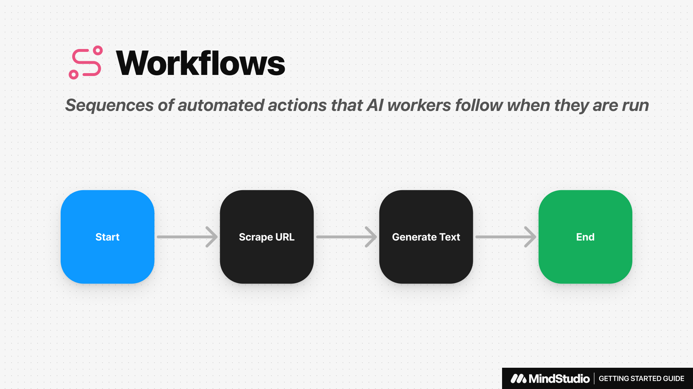

# Quickstart Guide

In this article, we’ll be guiding you through everything you need to know to get started on MindStudio and teaching you to create your first AI Agent.



## Prerequisites

Before starting, you will need to [create a MindStudio Account](https://app.mindstudio.ai/signup).

## Getting Started

After creating an account, you'll land on the **Workspace Overview Screen**, where you can view all published AI Agents. If there are no AI Agents published, then you will see the Getting Started Guide.

## Workspace Overview

From the Workspace Overview Screen, you’ll find several controls on the left. From here you can:

* Create new workspaces.
* Access general [Workspace Settings](https://www.notion.so/Workspace-Settings-144b0c63a7ff805e949fe1055ce8db40?pvs=21).
* Explore [Usage Explorer](https://www.notion.so/Usage-Explorer-144b0c63a7ff80e19016ebc3110c47c4?pvs=21) to view AI Agent activity.
* Manage [Billing Settings](https://www.notion.so/Billing-Settings-144b0c63a7ff80b99b15cb474f0ad334?pvs=21) (e.g., budget limits, payment methods).
* [Invite team members](https://www.notion.so/Inviting-New-Members-144b0c63a7ff802c80cec5028ba6aa7b?pvs=21) to your workspace.
* Access [developer tools](https://www.notion.so/API-Reference-141b0c63a7ff802eb069ce487dfa28c2?pvs=21) like API Keys, Request Logs, and Documentation.

## **Building your First AI Agent**

In this guide, we’ll build an example AI Agent to find daily tech news, summarize it, and sends an email every morning at 8:00 AM.

<figure><figcaption></figcaption></figure>


### Step 1: Create a New AI Agent

To create an AI Agent, click on the **Create New Agent** button at the top-right. This will create a new Agent and open the MindStudio Editor.

#### MindStudio Editor Overview

The editor is made of two key areas: the **Explorer Tab** and the **Navigator**.

**Explorer Tab**

This is where you'll find all of the resources used to build your AI Agents. This includes resources like **Data Sources**, **Functions**, **User Inputs**, and **Workflows**

<figure><figcaption><p>Data Sources let you upload and vectorize files to leverage RAG in your AI Agents.</p></figcaption></figure>

<figure><figcaption><p>Functions let you execute custom JavaScript code in your AI Agents.</p></figcaption></figure>

<figure><figcaption><p>User Inputs are interfaces that Humans interact with to provide context to the AI Agent.</p></figcaption></figure>

<figure><figcaption><p>Workflows are sequences of automated actions that AI Agents follow when they are run.</p></figcaption></figure>

**Navigator (Main Workspace)**

The large area covering the rest of the Editor if the Main Workspace, also refer to as the **Navigator**. This area will change depending on what you have selected. By default, the Editor will open on the `Main.flow` workflow and have the **Prompt Tab** open.

***

### Step 2: Write the System Prompt

The System Prompt serves as the AI Agent's core instructions, defining its role, capabilities, and constraints.

You can write a system prompt manually by typing into the blank space below, or you can click on the **Generate Prompt** button at the bottom left to have the **Prompt Generator** to write the prompt for you.

#### Using the Prompt Generator

* Click on the **Generate Prompt** button at the bottom left of the prompt area. This will open the Prompt Generator Modal.
*   Using natural language, enter a brief description of what your AI Agent is supposed to do. For this build, we can type something like:

    <pre class="language-markdown"><code class="lang-markdown"><strong>Find daily technology news, summarize it, and send an email at 8:00 AM.
    </strong></code></pre>
* After entering your description, click the **Generate** button. The system will automatically create a structured prompt based on your input.
* Carefully review the generated prompt to make sure it aligns with your requirements. You can edit the prompt directly in the editor if adjustments are needed.

Once your System Prompt is written, navigate to the **Automations** tab.

***

### Step 3: Design a Workflow in the Automations Tab

The **Automations Tab** is where you design the workflow for your AI Agent. This section allows you to define the sequence of actions your AI Agent will follow.

#### **Example Workflow: Daily Tech News AI** Agent


1. **Start Block**:
   * Schedule the workflow to run at 8:00 AM daily.
   * Define a launch variable called `topic`.
2. **Google Search Block**:
   * Use a function to perform a Google search.
   * Reference the `topic` variable as the search query.
   * Save the result as a new variable, `google_result`.
3.  **Text Generation Block**:

    * Prompt AI to summarize the `google_result`.
    * Use the prompt:

    ```markdown
    Summarize the following information: {{google_result}}
    ```
4. **Terminator End Block w/ Email Notification**:
   * Enable Email notifications to send the summary to the specified email.

***

### Step 4: Choose an AI Model

MindStudio provides access to over 50 AI models from leading providers, allowing you to tailor your workflows for a variety of tasks and use cases.

1. **Access Model Settings**
   * Navigate to the **Model Settings Tab** in your workflow editor.
2. **Choose a Model**
   * Select from over 50 AI models available.
   * **NOTE:** Some models may be locked and can be unlocked by adding a payment method in your **Billing Settings**.

***

#### **Configuring Model Settings**

There are two configuration options for AI models:

1. **Temperature**
   * Controls the randomness of responses:
     * **Higher Temperature**: More creative, but less predictable.
     * **Lower Temperature**: More consistent, but less diverse.
2. **Max Response Size**
   * Defines the maximum size of the model’s response in tokens.
   * Example: 400 tokens ≈ 300 words.

***

#### **Using Multiple AI Models Within a Workflow**

Every block that uses AI has the ability to override the underlying models settings and use its own unique AI model and configuration. This allows you to use different models in the workflow based on the task required at each specific step.

***

### **Step 5: Test and Evaluate Your Workflow**

Testing and evaluation are critical steps to ensure your AI Agent performs as expected. MindStudio provides tools to debug, validate, and optimize your AI Agents.

***

#### **How to Check for Errors in Your Workflow**

* Navigate to the **Errors Tab** to view any issues, such as misspelled variables or misconfigured blocks.
* Click on an error in the **Errors Tab** to highlight the problematic block in the workflow.
* Adjust configurations or correct spelling to resolve the issue.
* Once fixed, errors will disappear from the tab.

***

#### **Use Evaluations Tab to Generate Test Cases**

* Open the **Evaluations Tab** to create test scenarios for your workflow.
*   Click the **Autogenerate** button to generate test cases automatically. You can provide additional context for test case generation, such as specifying genres, topics, or scenarios.

    
    **Example:** Generate test cases for topics like technology, politics, or health.
    
* Specify how many test cases you want to generate.
* Review the generated cases to ensure they cover a variety of inputs
* Use the **Run** button in the top-left to execute the workflow multiple times with the test cases.
* After execution, review the results in the right-hand column. Check whether the outputs align with expected behavior.

***

### Step 6: Publish Your AI Agent

Once your AI Agent has been tested and evaluated to ensure it functions correctly, the next step is to publish it. Publishing makes your AI Agent available for use and integration.

#### **Steps to Publish Your AI** Agent

1. **Set Metadata**
   * Navigate to the **Explorer Tab** and click on the root menu.
   * Add the following details:
     * **Name**: Give your AI Agent a descriptive and unique name.
     * **Description**: Provide a short explanation of what your AI Agent does.
   * Go through other sections and configure other settings.
2. **Publish the Workflow**
   * Click the **Publish** button to finalize your AI Agent.
   * Once published, the AI Agent will be accessible via the **Published Tab** in your workspace. Click on the confirmation message to view your AI Agent.
3. **Integration Options**
   * After publishing, you can integrate your AI Agent with external tools and platforms, such as:
     * **Zapier**: Automate workflows across apps.
     * **Make**: Build advanced automation scenarios.
     * **API**: Use the provided documentation to connect via custom APIs.
4. **Test Request Integration**
   * Use the **Create** **Test Request** feature to validate API calls.
   * Configure the API request by:
     * Selecting a workflow.
     * Providing launch variables (e.g., `topic = "daily tech news"`).
   * Run the test and review the logs for successful execution.
5. **View the AI Agent in the Workspace Overview**
   * View the newly published AI Agent under the **Home Tab**.
   * Confirm it is listed alongside other published Agents.

## **Conclusion**

Congratulations on creating and publishing your first AI Agent in MindStudio! We’ve covered everything from writing system prompts and building workflows to testing, debugging, and publishing. MindStudio is a powerful and versatile platform, enabling you to create AI Agents tailored to specific needs.

Remember, this guide is just the beginning. The possibilities with MindStudio are endless, and we’re excited to see what you’ll build. If you ever need help, our **Support Chat** is just a click away.
