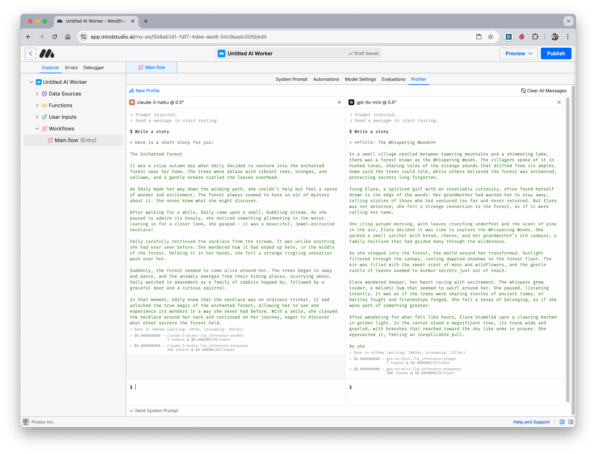

# Profiler

The **Profiler** in MindStudio lets you test and compare AI model outputs side-by-side. By experimenting with different models and configurations, you can evaluate AI Models for criteria like cost, latency, context, and quality, to ensure that you choose the right model for the right task in each step of your workflow.

***

## How to Use the Profiler

### 1. Access the Profiler (3 ways)

#### From a Workflow

Navigate to the **Profiler** tab within the desired workflow.

#### From a Generate Text Block

You can open the Profiler from a Generate text block by clicking on the **Open in Profiler** button above the prompt configuration.

#### From the System Prompt

You can open the profiler form the prompt tab by clicking on **Test in Profiler** button located at the bottom right of the tab.

<figure><figcaption>
Profiler from System Prompt
</figcaption></figure>

### 2. Select and Add Profiles of AI Models

* Add models to compare using the dropdown menu. Each model profile is displayed side-by-side for easier comparison.
* You can add as many profiles as you’d like. New AI Model profiles will appear to the right and you’ll need to horizontally scroll to view more than 4 profiles.

### 3. Adjust Settings

* Click the AI model name in each profile to configure parameters like **Temperature** and **Max Response Size** for each profile.
* Save the adjustments by clicking **Done**.

<figure><figcaption></figcaption></figure>

### 4. Enter Prompts

* Type a test prompt into the input box and send it. You can also toggle **Send System Prompt** to include your workflow’s system-level instructions in the evaluation.

### 5. Analyze Results

* Compare the quality of outputs generated by each model.
* Review the token usage, latency, and cost metrics for each response.

***

## **Considerations When Selecting an AI Model**

Choosing the right AI model is critical to ensuring your workflow meets performance, cost, and quality requirements. MindStudio provides a variety of models with different capabilities, trade-offs, and configurations. When selecting a model, it's often necessary to balance these considerations to align with your workflow's goals and constraints.

### **Price**

AI models come with varying pricing structures based on usage, typically measured in tokens for prompt and response.

Use cost-effective models for high-volume, repetitive tasks (e.g., bulk summarization). Opt for premium models only when high output quality is critical.

### **Latency**

Latency refers to the time the model takes to generate a response. Low-latency models are essential for real-time or interactive workflows.

Prioritize low-latency models for use cases like chatbots or live applications. For non-time-sensitive workflows (e.g., scheduled reports), higher latency models with better quality may be acceptable.

### **Output Quality**

Different models vary in their ability to generate coherent, creative, or factual responses. Output quality depends on the model’s training and capabilities.

Choose advanced models for nuanced tasks like legal summaries or creative writing. Use simpler models for straightforward tasks like data extraction.

### **Context Window**

The context window determines the maximum amount of text the model can process at once. Larger context windows are essential for tasks involving lengthy inputs.

Use models with large context windows for summarizing lengthy documents or analyzing extensive datasets. For shorter inputs, a smaller context window may suffice and reduce costs.
