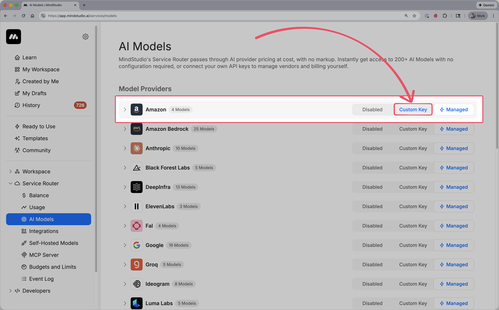

# Configuring Manual Connections to AI Model Providers

MindStudio allows you to manually connect to AI model providers by supplying your own API keys. This gives you full control over billing, quotas, and provider-specific settings while still using the MindStudio Service Router to access models inside agents, workflows, and tools.

## How to Add a Custom Connection

#### 1 – Navigate to [MindStudio AI Models Page](https://app.mindstudio.ai/services/models)

<figure><figcaption></figcaption></figure>

**Workspace Sidebar → Service Router → AI Models**

* This page lists all supported model providers along with their available models and connection status.

#### 2 – Add your custom API Key

<figure><figcaption></figcaption></figure>

* Locate the provider you want to configure (for example, OpenAI, Anthropic, Google)
* Click **Custom Key** on the right side of the provider row
* A modal will appear prompting you to enter an API key
* Paste your provider-issued API key into the field
* Click **Save**

## Understanding Provider Connection States

Each provider row shows three possible states:

* **Disabled** – The provider is not currently usable
* **Custom Key** – The provider uses your manually supplied API key
* **Managed** – The provider uses MindStudio-managed routing and billing

You can switch between Managed and Custom Key at any time.

## Verifying the Connection

After saving a custom key:

* The provider status updates to **Custom Key**
* All supported models under that provider become selectable
* Requests route directly to the provider using your credentials

If a key is invalid or revoked, requests will fail and surface an upstream provider error.

## Switching Back to Managed Routing

You can revert to MindStudio-managed billing at any time:

1. Return to **AI Models**
2. Find the provider
3. Click **Managed**

This disables your custom key and resumes routing through MindStudio’s shared infrastructure.

